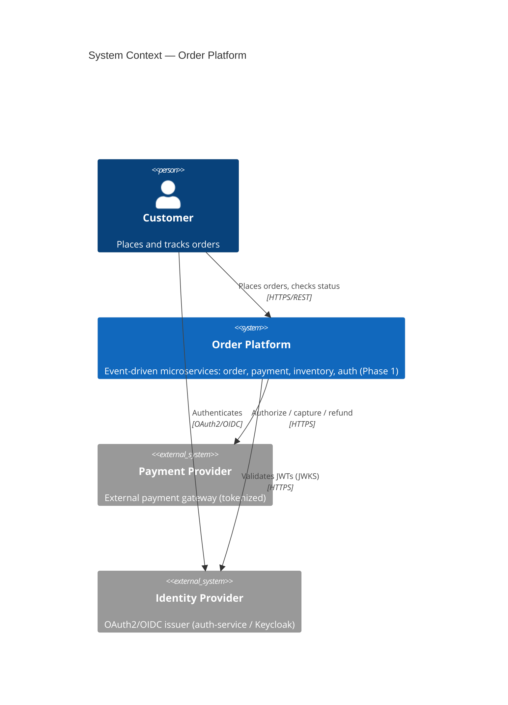
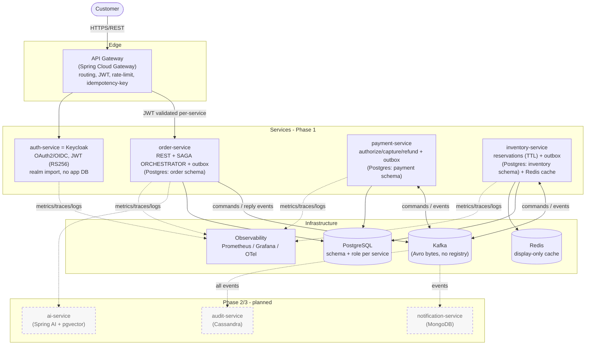

# C4 Diagrams — Event-Driven Microservices Platform

[C4 model](https://c4model.com/) views of the platform, at Context and Container levels.
Diagrams use Mermaid so they render directly on GitHub. Phase 1 scope is drawn solid;
Phase 2/3 services are shown dashed as planned.

## Level 1 — System Context

## Level 2 — Containers

## Notes

- **Every service validates the caller's JWT itself** — the gateway is not a trust
  boundary (ADR-0009).
- **order-service hosts the saga orchestrator**; participants (payment, inventory)
  communicate via Kafka commands/reply events, **not** synchronous calls (ADR-0003).
- **Every producer has a transactional outbox** (ADR-0004).
- **Redis is display-only** and never backs a reservation decision (ADR-0007).
- Container-level detail (components inside a service) is added per service during the
  build phase.
