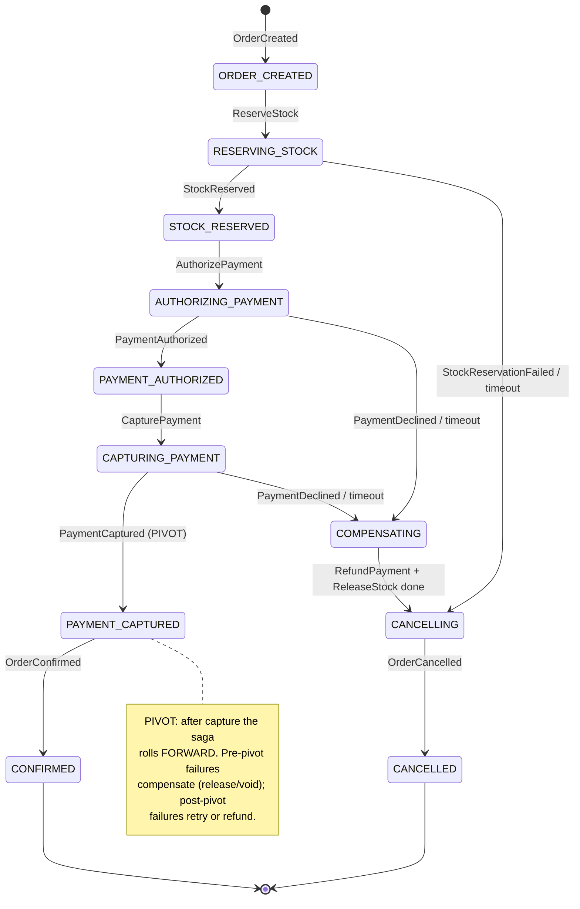

# Order Saga — State Machine & Failure Matrix

The order → payment → inventory saga, orchestrated by order-service
([ADR-0003](../adr/0003-async-saga-orchestration.md)). Saga state is **persisted**
(`saga_instance`), driven by **Kafka commands and reply events**, with **timer-driven
deadlines**. `PaymentCaptured` is the **pivot**.

## State machine

## Step-by-failure compensation matrix

| Step | On success | On failure (pre-pivot) | On failure (at/after pivot) |
|---|---|---|---|
| Reserve stock | → authorize payment | Cancel order (nothing to undo) | n/a |
| Authorize payment | → capture payment | Release stock → cancel order | n/a |
| Capture payment (**pivot**) | → confirm order | Release stock → cancel order | Retry capture; if truly unrecoverable, alert + reconcile |
| Confirm order | Done (CONFIRMED) | n/a | Roll forward — already captured; retry confirm |
| Compensation: refund + release | → cancelled | — | Refund payment, release stock, then CANCELLED |

## Hard cases explicitly handled

- **Timeouts:** every awaiting state has a persisted deadline; a timer fires
  retry-or-compensate. The orchestrator never blocks a thread waiting.
- **Late replies:** a reply that arrives *after* a timeout+compensation must not
  corrupt state. Terminal states are idempotent; a stray `PaymentAuthorized` after
  `CANCELLED` triggers reconciliation (void/refund), not a state change.
- **Idempotency:** every command/reply carries `eventId`; participants and the
  orchestrator dedup (ADR-0005), so redelivery is safe.
- **Non-compensatable actions** (e.g. customer notification) fire **only after the
  pivot** — never during a phase that might still compensate.
- **Ordering:** per-order messages share a partition (key = `aggregateId`), so replies
  for one order are ordered; retry topics relax this and the saga tolerates it because
  it is driven by persisted state, not message order.
