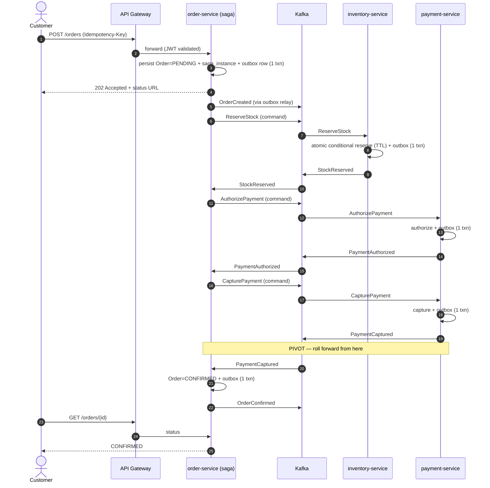
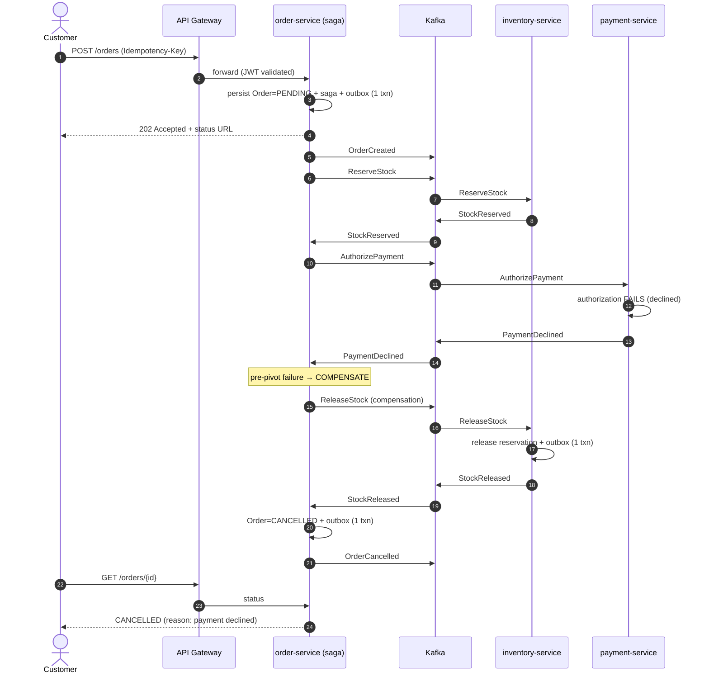

# Order Saga — Sequence Diagrams

Two flows through the order saga ([ADR-0003](../adr/0003-async-saga-orchestration.md)):
the happy path, and the payment-failure compensation path (the scenario the
one-command demo triggers on purpose). All inter-service communication is asynchronous
via Kafka; every producer writes through its **outbox** (ADR-0004); every consumer is
**idempotent** (ADR-0005). Envelope carries `correlationId` + `traceparent` end to end
(ADR-0010, ADR-0013).

## Happy path — order confirmed

## Compensation path — payment declined (pre-pivot)

## Why these two

The happy path shows the full async orchestration with outbox at every hop. The
compensation path shows the saga *undoing* completed work (releasing the stock
reservation) when a later step fails — the core reason a saga exists. The demo script
forces the decline so a reviewer can watch compensation happen live, with one
`correlationId` tying the whole flow together in the traces.
